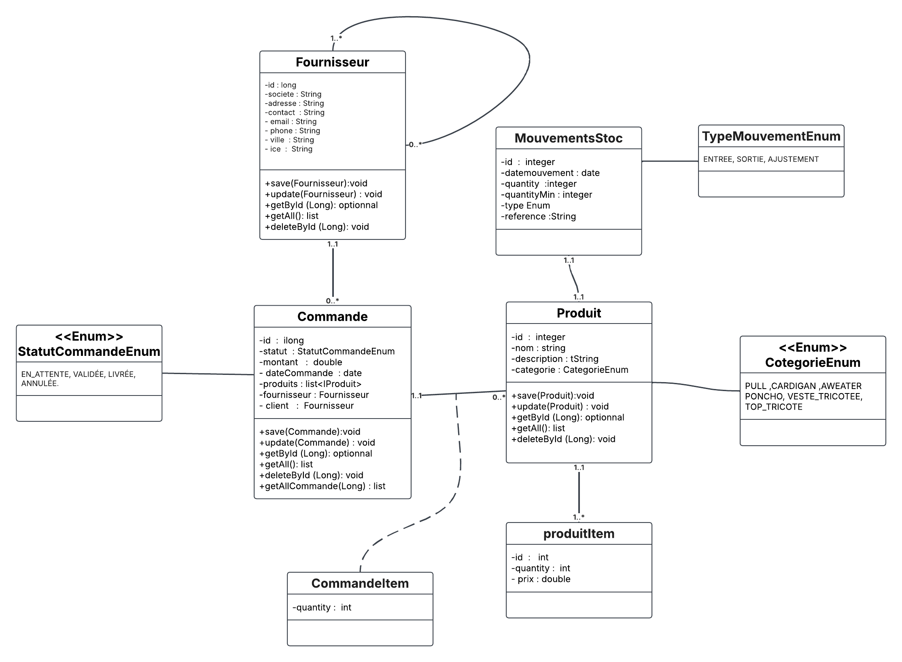

# 🧾 Gestion des Commandes Fournisseurs - Tricol

## 🏢 Contexte du projet

L’entreprise **Tricol**, spécialisée dans la conception et la fabrication de vêtements professionnels, poursuit la **digitalisation de ses processus internes**.  
Après la mise en place du module de **gestion des fournisseurs**, la direction souhaite développer un **module complémentaire** dédié à la **gestion des commandes fournisseurs**.

Ce module vise à assurer un **suivi rigoureux des approvisionnements** en matières premières et équipements.  
Il s’inscrit dans la démarche globale de mise en place d’un **système complet de gestion des approvisionnements et de la production**.

---

## 🎯 Objectif du projet

Développer une **API REST complète** avec **Spring Boot**, permettant de gérer **tout le cycle de vie des commandes fournisseurs**, depuis leur création jusqu’à leur suivi.

Le projet devra appliquer les **bonnes pratiques modernes** de :
- Spring Boot
- Spring Data JPA
- MapStruct
- Swagger / OpenAPI
- Liquibase

---

## 🛠️Diagramme de classes ## 



---
## ⚙️ Exigences fonctionnelles

### 🔹 Gestion des Fournisseurs
- Ajouter, modifier, supprimer et consulter un fournisseur.
- Informations :
    - `societe`
    - `adresse`
    - `contact`
    - `email`
    - `phone`
    - `ville`
    - `ice`

### 🔹 Gestion des Produits
- Chaque commande est associée à un ou plusieurs produits.
- Informations produit :
    - `nom`
    - `description`
    - `prixUnitaire`
    - `categorie`

### 🔹 Gestion des Commandes Fournisseurs
- Créer une nouvelle commande fournisseur.
- Modifier ou annuler une commande existante.
- Consulter la liste de toutes les commandes.
- Consulter le détail d’une commande spécifique.
- Associer une commande à un fournisseur et à une liste de produits.
- Calcul automatique du **montant total** de la commande.
- Statuts possibles :  
  `EN_ATTENTE`, `VALIDÉE`, `LIVRÉE`, `ANNULÉE`.

---

## 📦 Gestion des Mouvements et Valorisation du Stock

Ce module doit intégrer une **logique complète** de suivi des **entrées et sorties de stock**, ainsi que la **valorisation des coûts** selon des méthodes précises.

### Objectifs :
- Suivre les entrées et sorties de stock liées aux commandes fournisseurs.
- Mettre à jour automatiquement les **quantités disponibles**.
- Calculer le **coût total d’approvisionnement** selon une méthode configurable :
    - `FIFO` (First In, First Out)
    - `CUMP` (Coût Unitaire Moyen Pondéré)

---

## ⚡ Fonctionnalités attendues

### 1️⃣ Mouvements de stock automatiques
- Lorsqu’une commande fournisseur est **livrée**, des mouvements de type **ENTREE** sont créés automatiquement pour chaque produit.
- Chaque mouvement contient :
    - Date
    - Quantité
    - Type (`ENTREE`, `SORTIE`, `AJUSTEMENT`)
    - Référence à la commande fournisseur

### 2️⃣ Mise à jour du stock disponible
- Le champ `stockActuel` du produit est mis à jour après chaque mouvement.
- En cas de **sortie** ou d’**ajustement**, la quantité disponible diminue.

### 3️⃣ Méthodes de valorisation du stock
Deux méthodes de calcul du coût unitaire sont supportées :
- **FIFO** : les premières entrées sont les premières sorties.
- **CUMP** : le coût moyen pondéré est recalculé après chaque entrée.

> ⚙️ La méthode utilisée est configurable via les paramètres de l’application (par défaut : **CUMP**).

### 4️⃣ Calcul du coût total d’une commande fournisseur
\[
\text{montantTotal} = \sum (prixUnitaireProduit \times quantitéCommandée)
\]
En cas de valorisation CUMP, le **coût moyen pondéré** est pris en compte pour refléter le coût réel d’achat.

### 5️⃣ Consultation de l’historique des mouvements
L’API doit permettre de consulter les mouvements de stock :
- Par produit
- Par type de mouvement
- Par commande associée

> Nouvelle entité : **MouvementStock**

---

## 📄 Pagination et Filtrage

### Objectifs :
- Limiter le volume de données retournées.
- Permettre la navigation page par page.
- Faciliter la recherche et le tri.

### Détails techniques :
- Utilisation de **Spring Data JPA Pageable** et **Page**.
- Les endpoints `GET` acceptent les paramètres suivants :
    - `page` : numéro de la page (par défaut `0`)
    - `size` : nombre d’éléments par page (par défaut `10`)
    - `sort` : champ de tri (ex. `sort=societe,asc`)

### Résultat attendu :
La réponse JSON doit contenir :
- La liste des éléments de la page courante
- Le nombre total d’éléments
- Le nombre total de pages

---

## 🧠 Exigences techniques

### 🛠️ Technologies principales
- Spring Boot
- Spring Data JPA
- MapStruct
- Liquibase
- Swagger / OpenAPI
- Jakarta Validation

---

## 🧩 Architecture attendue

L’application doit suivre une **architecture en couches claire** :

| Couche | Rôle |
|:--------|:-----|
| **Controller** | Expose les endpoints REST (API) |
| **Service** | Contient la logique métier |
| **Repository** | Accès aux données via Spring Data JPA |
| **DTO & Mapper (MapStruct)** | Conversion entre entités et objets de transfert |
| **Liquibase** | Gestion de la base de données et des migrations |

---

## 🧱 Modèle de données (simplifié)

### Entité **Fournisseur**
- `id`
- `societe`
- `adresse`
- `contact`
- `email`
- `phone`
- `ville`
- `ice`

### Entité **Produit**
- `id`
- `nom`
- `description`
- `prixUnitaire`
- `categorie`

### Entité **CommandeFournisseur**
- `id`
- `dateCommande`
- `statut`
- `montantTotal`
- `fournisseur` *(ManyToOne)*
- `listeProduits` *(ManyToMany)*

---

## 📘 Documentation

Une documentation Swagger sera disponible à l’adresse :
http://localhost:8080/swagger-ui.html

---

## 🚀 Lancement du projet

1. Cloner le dépôt :
   ```bash
   git clone https://github.com/lakrounehamza/Gestion-des-Approvisionnements-pour-Tricol_Version2.git
   
cd Gestion-des-Approvisionnements-pour-Tricol_Version2
